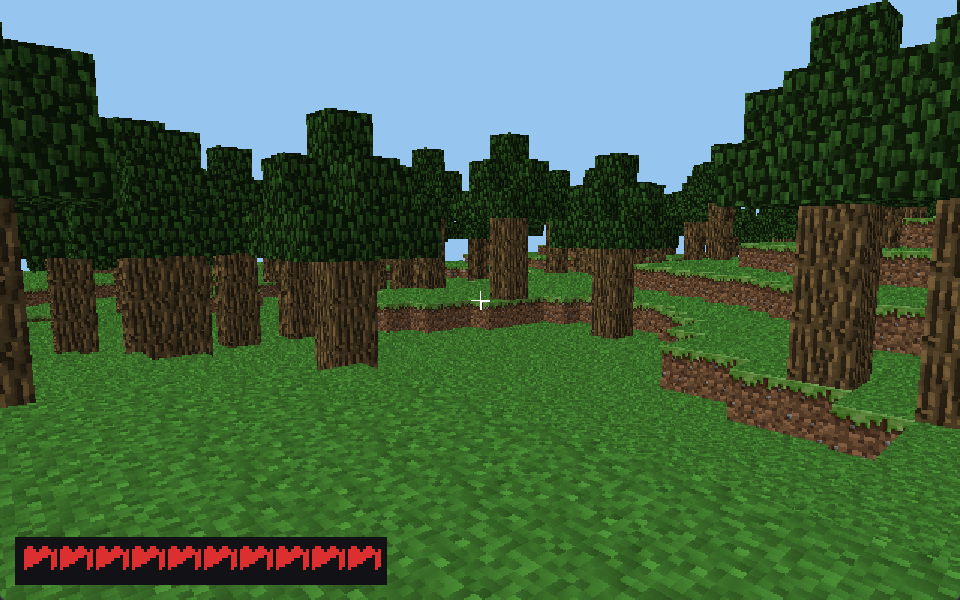
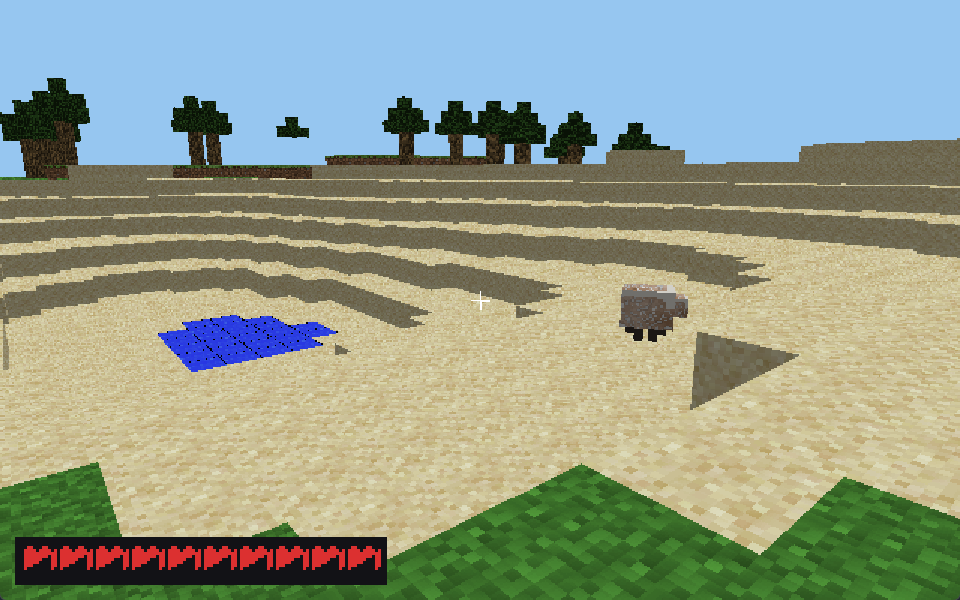
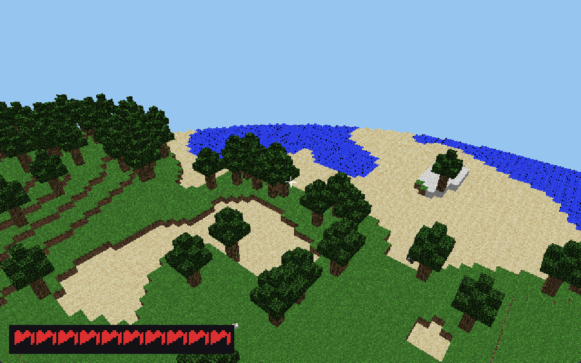

# voxel — a Minecraft-style survival world in Axle (SDL2)

A first-person **survival** voxel world software-rendered into an SDL2
window. You are a real entity: gravity pulls you down, you stand and walk
on solid streamed terrain, jump, swim, and take fall / drowning damage
with health that regenerates. The land is an **infinite, streamed**
landscape of Minecraft-like biomes — ocean, beach, plains, forest,
desert, savanna, snowy, mountains — with trees and oceans, and
texture-skinned passive **mobs** (chickens, sheep, cows) that wander and
graze, panic-run when struck, and topple over when killed. Everything is
drawn by a z-buffered, textured triangle rasteriser over face-culled
geometry.

## Screenshots

| Forest | Desert | Coast |
|--------|--------|-------|
|  |  |  |

## Controls

| Input            | Action                  |
|------------------|-------------------------|
| Mouse            | look around (captured)  |
| `W` `A` `S` `D`  | walk                    |
| `LCtrl`          | sprint                  |
| `Space`          | jump / swim up          |
| Left-click       | attack the mob in front |
| `Esc` / close    | quit                    |

## Prerequisites

You need two things: the **Axle compiler** (v0.2.11 or newer) and the
**SDL2** library.

### 1. Install the Axle compiler (v0.2.11+)

This project must be built with Axle **v0.2.11 or newer**. Check what you
have:

```bash
axle --version      # must print 0.2.11 or higher
```

If it's missing or older:

- **Windows** — install the Windows x64 `.msi` from the `v0.2.11` (or
  newer) release; it installs `axle.exe` to `C:\Program Files (x86)\Axle\`
  and onto your `PATH`. Or build from source from the `axle` compiler repo:
  ```powershell
  # needs Visual C++ Build Tools + LLVM 18 (see the axle repo's SETUP-WINDOWS.md)
  $env:LLVM_SYS_181_PREFIX = "C:\Program Files\LLVM"
  cargo build --release -p axle_cli   # -> target/release/axle.exe (add to PATH)
  ```
- **Linux (apt)** —
  ```bash
  sudo install -m 0755 -d /etc/apt/keyrings
  curl -fsSL https://apt.axle-lang.dev/key.asc \
      | sudo gpg --dearmor -o /etc/apt/keyrings/axle.gpg
  echo "deb [signed-by=/etc/apt/keyrings/axle.gpg arch=amd64] https://apt.axle-lang.dev stable main" \
      | sudo tee /etc/apt/sources.list.d/axle.list
  sudo apt update && sudo apt install axle   # LLVM 18 + lld pulled in automatically
  ```
- **macOS / no apt** — use the Docker image or build from source (see the
  axle compiler repo's `docs/src/getting-started/install.md`).

### 2. Install the SDL2 library

The engine links against SDL2 and needs `SDL2.dll` next to the binary at
runtime.

- **Windows (vcpkg)** —
  ```powershell
  vcpkg install sdl2:x64-windows
  ```
  Then point `axle.toml`'s `[link] paths` at vcpkg's `lib` directory
  (e.g. `C:/vcpkg/installed/x64-windows/lib`) and copy
  `SDL2.dll` (from `C:/vcpkg/installed/x64-windows/bin`) into `target/`.
- **Linux** — `sudo apt install libsdl2-dev` (then set `[link] paths` to the
  system lib dir if needed).
- **macOS** — `brew install sdl2`.

## Build & run

From this directory, with `axle --version` reporting 0.2.11+ and SDL2
installed:

```bash
axle run            # compile + run
```

Other useful commands: `axle build` (compile to a binary without running)
and `axle check` (type-check only). Make sure `SDL2.dll` and `atlas.raw`
sit next to the produced binary (in `target/`).

## Architecture

The code is built as a small object hierarchy on top of a data-oriented
chunk world. Living things share one physics implementation through
inheritance; the world, renderer and HUD are plain engine modules.

```
                 ┌────────────┐
                 │   Entity   │  posX/Y/Z, velY, hp, radius, gravity +
                 │            │  solid collision + auto-step, damage / heal
                 └─────┬──────┘
            extends    │    extends
        ┌──────────────┴───────────────┐
   ┌────▼─────┐                    ┌────▼────┐
   │  Player  │ FPS camera, input, │   Mob   │ AI + skins (chicken/sheep/cow)
   │          │ jump/swim, fall &  │         │
   │          │ drown & regen      │         │
   └──────────┘                    └─────────┘
```

### Source layout

Modules are grouped into folders by role. Within the package, a `use`
that crosses folders is written from the source root with a `crate::`
prefix (like Rust); same-folder siblings can be imported by bare name.

```
src/
  main.axle              window, spawn, the input → simulate → render loop
  config.axle            every tunable: screen, stream, noise, blocks &
                         biomes, physics, mobs, HUD   ← change the feel here
  platform/
    sdl.axle             SDL2 FFI + framebuffer / keyboard / mouse helpers
  world/
    noise.axle           value noise + fbm; height / temperature / humidity
    blocks.axle          block table: id → tile / colour    ← add blocks
    biome.axle           temp × humidity × height → biome → surface/trees
    manager.axle         ChunkManager: streamed slots, meshing, and the
                         columnHeight() / collisionHeight() physics queries
  entities/
    entity.axle          Entity base: gravity, solid collision, damage
    player.axle          Player extends Entity: look, move, fall/drown/regen
    mob.axle             Mob extends Entity: animal AI (wander/graze/flee/die)
    mobs.axle            MobManager: spawn ring, AI update, despawn, melee
  gfx/
    raster.axle          triangle rasteriser + z-buffer (textured + flat)
    render.axle          project + cull + draw world faces; mob cuboids
    hud.axle             health hearts drawn straight into the framebuffer
```

### Why inheritance here

`Player` and `Mob` are genuinely the same *kind* of thing physically: both
fall, both stand on the heightmap, both step up one-block ledges, both can
be hurt. That shared behaviour lives once in `Entity` and is reused by both
subclasses unchanged — `Player.update` and `Mob.aiStep` only decide *what
horizontal move to feed the shared `tick`*, and how to react to health and
the recorded landing `impact`. Adding a new animal is a new `Entity`
subclass plus a draw case.

## How it works

1. **Streaming.** A `span × span` ring of chunk slots is addressed by
   chunk-coordinate modulo `span`, so a chunk keeps its slot as the player
   moves; crossing a border only regenerates the newly entered chunks.
2. **Generation.** Per column, `terrainHeight` warps the sample point,
   raises land out of the ocean with low-frequency *continentalness*, adds
   hills, and lifts mountains where continentalness is high. A
   `temperature × humidity` climate grid (plus elevation) picks the biome,
   which decides the surface/filler blocks and the tree density.
3. **Physics.** `Entity` integrates gravity into `velY` and lands the feet
   on `ChunkManager.collisionHeight()` — the solid surface of the column,
   which folds a tree trunk's top into the terrain so trunks are solid.
   Horizontal movement keeps the whole body (a disc of `radius`) outside
   block faces, so you cannot clip through a cliff or a trunk, while still
   auto-stepping up gentle one-block ledges. Hard landings record an
   `impact` the `Player` turns into fall damage; submersion drains breath
   then health; time without damage regenerates it.
4. **Mobs.** `MobManager` keeps a live `Mob[]`, spawns chickens / sheep /
   cows on dry land in a ring around the player, steps each one's AI,
   despawns the distant, and resolves a left-click into damage on the
   nearest mob in the view cone. Each mob eases smoothly toward a target
   heading, alternates wandering with standing to graze, hops now and then,
   and bolts away in a panic when hit (chickens flutter down slowly).
   Killing one starts a `dying` state: the renderer collapses it over
   `deathFrames` (sink + squash + topple) before the manager removes it.
5. **Rendering.** World faces are near-plane clipped (so hugging a block
   never tears a hole), projected (`1/z`) and filled with their
   **Minecraft block texture** (perspective-correct atlas sampling), shaded
   by `normal·light`. Mobs are stacks of textured boxes (legs/head/body
   from the entity skins, with a walk-cycle bob) sharing the world
   z-buffer; a struck mob flashes red. The heart HUD and crosshair are
   painted on top.

## Textures

Real Minecraft block textures are baked into `atlas.raw` (11 tiles, a
vertical strip): grass top/side, dirt, stone, sand, snow, gravel, oak log
side/top, leaves, water. The engine **loads `atlas.raw` at runtime**
(`sdl.loadAtlas`, tried from the project dir or `target/`) — it is not
embedded in the source, so textures can be re-baked without rebuilding.
`blocks.tileFor(id, dir)` maps a block face to its tile, the mesher stores
the tile per face, and `raster.rasterTriTex` samples it.

**Mobs** are skinned from the Minecraft entity textures under
`textures/entity/` (chicken, sheep, cow). `bake_mobs.py` crops a
representative 64×64 tile per body part, appends them to `atlas.raw`, and
regenerates the embedded hex; `config::useMobTextures` is on, so
`render.drawQuad` samples those tiles (flat colour is the fallback when
it's off). Re-run `python bake_mobs.py` after editing the entity PNGs.

(Flat-colour fallback: set `useMobTextures` to `false` and the mobs draw
from their per-part `rgb(...)` colours instead.)

## Seams for new features

- **New block**: id in `config`, tile/colour in `blocks`, place it in
  `manager`/`biome`.
- **New biome**: id in `config`, a branch in `biome.biomeAt`, its
  surface/filler/tree-density.
- **New animal**: a new `Entity` subclass (copy `mob`), a spawn case in
  `mobs`, and a draw case in `render`.
- **Editing the world** (dig / place): change a chunk's heightmap (or add
  a voxel-override layer) and re-`buildMesh` that slot.

## Notes / limitations

- Collision samples the columns under the entity's footprint against a
  per-column solid height that includes tree trunks, so terrain and trunks
  are solid; leaf canopies are passable.
- Heightmap terrain: no caves or overhangs yet (the mesher is the only
  thing to change for a full voxel field).
- `axle.toml`'s lib path is machine-specific; DLL + `atlas.raw` deployment
  next to the binary is manual.
